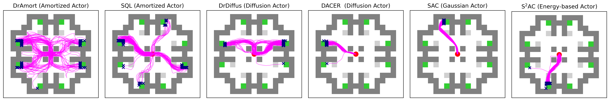
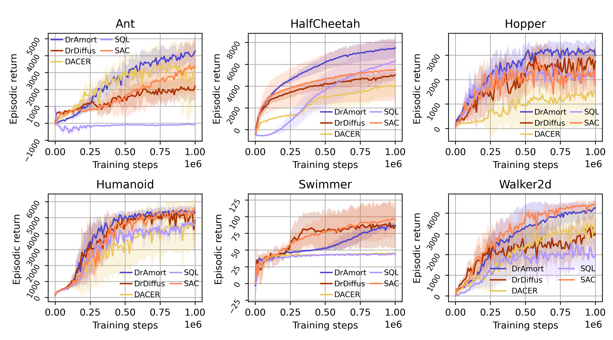

# DrAC
Official repository for NeurIPS 2025 publication "[Learning Intractable Multimodal Policies with Reparameterization and Diversity Regularization](https://arxiv.org/pdf/2511.01374)" 

This repository implements our proposed algorithm, diversity regularized actor critic (DrAC), which learns multimodal actors with diversity regularization.

Specifically, this repository contains implementations of *amortized actor* and *diffusion actor*. These kinds of actors are can express complex multimodal decision distributions, which is critical in some domains. Our method overcomes the intractibility challenge of such actors, elicites diverse multimodal behaviors efficiently and effectively.


Subfigure 1 and 3 visualize the behavior of amortized actor and diffusion actor trained by our algorithm.


DrAmort (DrAC with amortized actor) also exhibits competitive performance in standard mujoco benchmarks. 

### Installation
Run `pip install -r requirements.txt` (Recommended python version: 3.12)


### Run
Command to run our algorithm follows this format
```
python train.py {algo} --task {task} --options
```
{algo} and {task} must be specified. 
- {algo} should be one from "SAC", "DrAC", "DACER". 
- {task} shound be one from "MultiGoalPointMaze", "MarioLevelGen", and all mujoco environments.
- By specifying --options, default configurations or hyperparameter defined by `rl/config.yaml` in the same name will be rewrite.

For example, if you want to run our algorithm with a customized temperature ($\beta$ in the paper) at **0.6** in the **hard map** of MultiGoalPointMaze. 
The default maze map of the MultiGoalPointMaze environment is `maze_map=simple`, defined in line 38 of `rl/config.yaml`
The default temperature setting in MultiGoalPointMaze is `beta=0.8`, defiend in line 41 of  `rl/config.yaml`. Then, the complete command you need to run is

```
python train.py --task MultiGoalPointMaze --beta 0.6 --maze_map hard
```

### Citation
**bibtex**:
```
@inproceedings{wanglearning,
  title={Learning Intractable Multimodal Policies with Reparameterization and Diversity Regularization},
  author={Wang, Ziqi and Liu, Jiashun and Pan, Ling},
  booktitle={Annual Conference on Neural Information Processing Systems},
  year={2025}
}
```
**Text**:
```
Wang, Ziqi, Jiashun Liu, and Ling Pan. "Learning Intractable Multimodal Policies with Reparameterization and Diversity Regularization." Annual Conference on Neural Information Processing Systems. 2025.
```